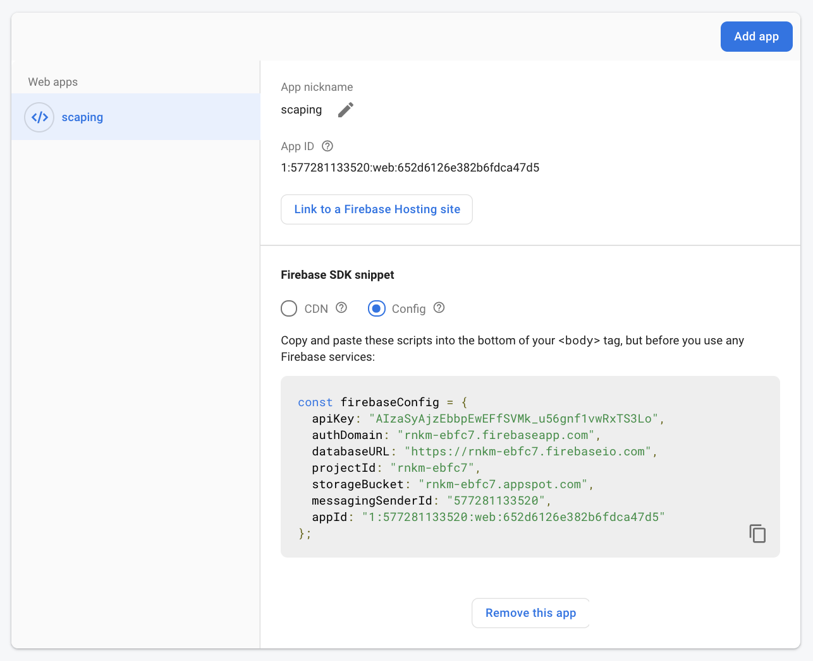
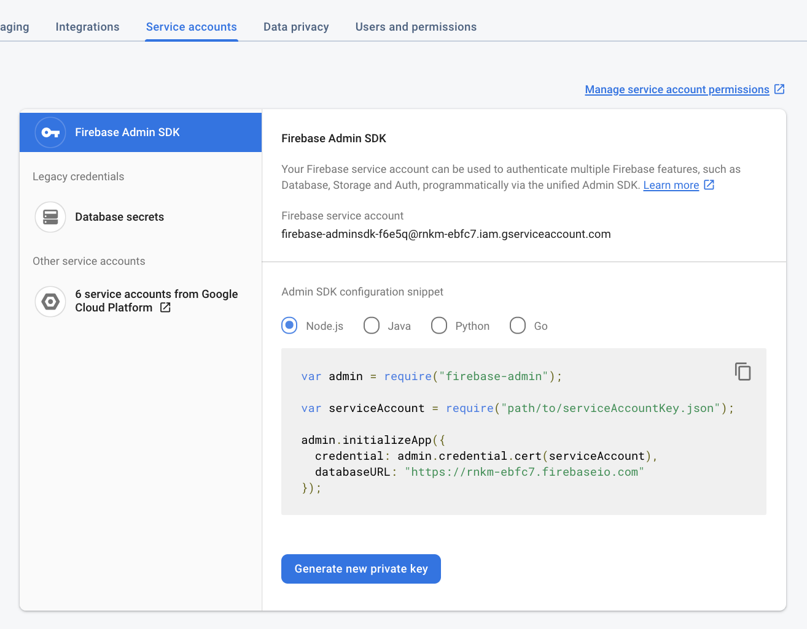

# firestore extract to excel

## 1. config

`config/firebase.ts`
```
export const FIREBASE_ADMIN = {
  "type": "service_account",
  "project_id": "",
  "private_key_id": "",
  "private_key": "",
  "client_email": "",
  "client_id": "",
  "auth_uri": "https://accounts.google.com/o/oauth2/auth",
  "token_uri": "https://oauth2.googleapis.com/token",
  "auth_provider_x509_cert_url": "https://www.googleapis.com/oauth2/v1/certs",
  "client_x509_cert_url": ""
}
export const FIREBASE_CLIENT = {
  apiKey: "",
  authDomain: "",
  databaseURL: "https://xxxx.firebaseio.com",
  projectId: "",
  storageBucket: "",
  messagingSenderId: "",
  appId: ""
};
```

## 2 run
```
yarn install
yarn start
```
## 3 result
`output/[project-id].xlsx`

----

__FIREBASE_CLIENT__ can found in 

1. https://console.firebase.google.com
1. Project Settings
1. General
1. your apps
1. Firebase SDK snippet
1. config




__FIREBASE_ADMIN__ can found in 

1. https://console.firebase.google.com
1. Project Settings
1. Firebase Admin SDK
1. Generated new Private Key

